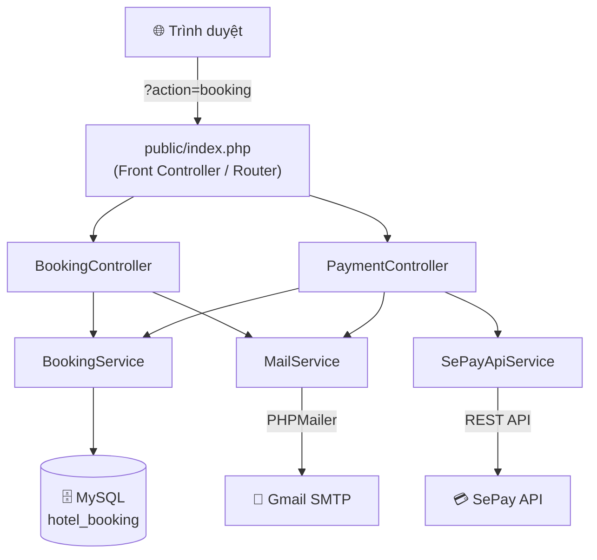
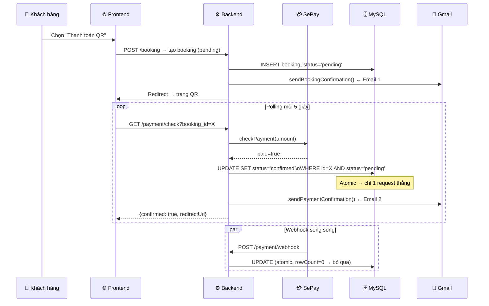
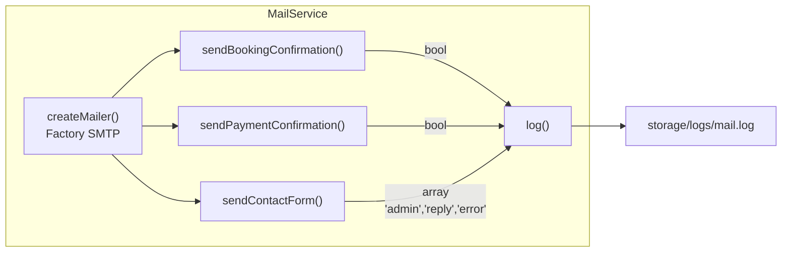

# 🏨 LuxStay Hotel — Hệ Thống Đặt Phòng Khách Sạn

<div align="center">


**Hệ thống đặt phòng khách sạn hiện đại, tích hợp thanh toán VietQR và thông báo email tự động.**

[📖 Tài liệu](#cài-đặt) · [🐛 Báo lỗi](https://github.com/phuc2502/nhom9_detai9/issues) · [✨ Tính năng](#tính-năng-nổi-bật)

</div>

---

## 📋 Mục lục

- [Giới thiệu](#giới-thiệu)
- [Tính năng nổi bật](#tính-năng-nổi-bật)
- [Kiến trúc tổng thể](#kiến-trúc-tổng-thể)
- [Cài đặt](#cài-đặt)
- [Chạy dự án](#chạy-dự-án)
- [Cấu hình môi trường](#cấu-hình-môi-trường)
- [Cấu trúc thư mục](#cấu-trúc-thư-mục)
- [Hướng dẫn đóng góp](#hướng-dẫn-đóng-góp)
- [Lộ trình phát triển](#lộ-trình-phát-triển)
- [Giấy phép](#giấy-phép)

---

## 🌟 Giới thiệu

**LuxStay Hotel** là ứng dụng web đặt phòng khách sạn được xây dựng bằng PHP thuần theo mô hình **MVC** (Model–View–Controller). Dự án tập trung vào trải nghiệm người dùng mượt mà, quy trình thanh toán tích hợp và hệ thống thông báo email tự động tin cậy.

Dự án được phát triển như một đồ án học tập nhóm, nhưng được xây dựng theo chuẩn thực tế với các kỹ thuật:

- **Atomic Database Operations** — tránh race condition khi nhiều request đồng thời
- **Factory Pattern** — tái sử dụng cấu hình SMTP cho tất cả loại email
- **Separation of Concerns** — mỗi lớp chỉ đảm nhận một trách nhiệm rõ ràng
- **Structured Logging** — ghi log có timestamp, level, và JSON data

---

## ✨ Tính năng nổi bật

| Danh mục | Tính năng |
|----------|-----------|
| 🛏️ **Đặt phòng** | Tìm kiếm phòng trống theo ngày, lọc theo giá / loại / tiện nghi, phân trang |
| 💳 **Thanh toán** | VietQR (SePay) với polling thời gian thực + Webhook, hoặc thanh toán tại quầy |
| 📧 **Email tự động** | Xác nhận đặt phòng, xác nhận thanh toán QR, auto-reply form liên hệ |
| 🔒 **Bảo mật** | XSS protection (`htmlspecialchars`), Atomic SQL update, SMTP App Password |
| 📊 **Logging** | Ghi log tất cả sự kiện email với `FILE_APPEND \| LOCK_EX` |
| 📱 **Giao diện** | Responsive, tương thích mobile, hỗ trợ tiếng Việt UTF-8 |

---

## 🏗️ Kiến trúc tổng thể

### Mô hình MVC



### Luồng thanh toán VietQR



### Luồng gửi email



---

## 🚀 Cài đặt

### Yêu cầu hệ thống

| Phần mềm | Phiên bản tối thiểu |
|----------|-------------------|
| PHP | 8.1+ |
| MySQL | 8.0+ |
| XAMPP / Laragon | Bất kỳ |
| Gmail Account | Bật 2FA để tạo App Password |

### Bước 1 — Clone dự án

```bash
# Clone vào thư mục htdocs của XAMPP
git clone https://github.com/phuc2502/nhom9_detai9.git C:/xampp/htdocs/nhom9_detai9
```

### Bước 2 — Import database

```bash
# Mở phpMyAdmin → Tạo database tên: hotel_booking
# Sau đó import file SQL
mysql -u root -p hotel_booking < hotelbooking.sql
```

Hoặc dùng phpMyAdmin:
1. Truy cập `http://localhost/phpmyadmin`
2. Tạo database `hotel_booking` (Collation: `utf8mb4_unicode_ci`)
3. Tab **Import** → chọn file `hotelbooking.sql` → Thực hiện

### Bước 3 — Cấu hình

```php
// Sửa file: config/config.php

// Database
define('DB_HOST', '127.0.0.1');
define('DB_NAME', 'hotel_booking');
define('DB_USER', 'root');
define('DB_PASS', '');          // ← Điền mật khẩu MySQL nếu có

// Email — App Password Gmail (xem hướng dẫn bên dưới)
define('MAIL_PASSWORD', 'xxxx xxxx xxxx xxxx');  // ← Thay bằng App Password của bạn
define('MAIL_USERNAME', 'your@gmail.com');
define('MAIL_FROM_EMAIL', 'your@gmail.com');
define('MAIL_ADMIN', 'admin@gmail.com');
```

> **💡 Tạo Gmail App Password:**
> 1. Vào [Google Account](https://myaccount.google.com) → **Bảo mật**
> 2. Bật **Xác minh 2 bước** (bắt buộc)
> 3. Tìm **App Passwords** → Tạo mới → Copy 16 ký tự

---

## ▶️ Chạy dự án

### XAMPP

```
1. Khởi động Apache và MySQL trong XAMPP Control Panel
2. Truy cập: http://localhost/nhom9_detai9/public/
```

### Kiểm tra hệ thống email

```bash
# Xem log email sau khi thực hiện đặt phòng
type C:\xampp\htdocs\nhom9_detai9\storage\logs\mail.log
```

Kết quả mong đợi:
```
[2026-05-07 14:50:33] [BOOKING_MAIL    ] {"to":"guest@gmail.com","bookingId":5,"status":"sent"}
[2026-05-07 14:55:10] [PAYMENT_MAIL    ] {"to":"guest@gmail.com","bookingId":5,"status":"sent"}
[2026-05-07 15:00:00] [CONTACT_MAIL    ] {"admin_sent":true,"reply_sent":true}
```

Nếu thấy `MAIL_ERROR` với `"SMTP Error: Could not authenticate"` → App Password đã hết hạn, cần tạo mới.

---

## ⚙️ Cấu hình môi trường

Tất cả cấu hình được tập trung trong `config/config.php`:

### Database

```php
define('DB_HOST', '127.0.0.1');   // Host MySQL
define('DB_PORT', '3306');         // Port (3307 nếu dùng Docker)
define('DB_NAME', 'hotel_booking');
define('DB_USER', 'root');
define('DB_PASS', '');
```

### Email (PHPMailer + Gmail SMTP)

```php
define('MAIL_HOST',       'smtp.gmail.com');      // SMTP Server
define('MAIL_PORT',       587);                    // STARTTLS
define('MAIL_USERNAME',   'your@gmail.com');       // Tài khoản đăng nhập SMTP
define('MAIL_PASSWORD',   'xxxx xxxx xxxx xxxx'); // App Password 16 ký tự
define('MAIL_FROM_NAME',  'LuxStay Hotel');        // Tên người gửi
define('MAIL_FROM_EMAIL', 'your@gmail.com');       // Email người gửi
define('MAIL_ADMIN',      'admin@gmail.com');      // Admin nhận form liên hệ
```

### Thanh toán SePay

```php
define('SEPAY_API_TOKEN', 'your_sepay_token');   // Token từ dashboard SePay
define('BANK_ID',         'MB');                  // Mã ngân hàng
define('BANK_ACCOUNT',    '123456789');           // Số tài khoản
define('ACCOUNT_NAME',    'NGUYEN VAN A');        // Tên chủ tài khoản
```

### Đường dẫn hệ thống

```php
define('ROOT_PATH', dirname(__DIR__));                  // Tự động — không sửa
define('LOG_PATH',  ROOT_PATH . '/storage/logs');       // Thư mục log
```

---

## 📁 Cấu trúc thư mục

```
nhom9_detai9/
│
├── 📂 app/                          # Toàn bộ logic ứng dụng (MVC)
│   ├── 📂 builders/
│   │   └── BookingBuilder.php       # Builder Pattern: tạo Booking từng bước
│   ├── 📂 controllers/
│   │   ├── BookingController.php    # Xử lý đặt phòng (form, store, confirm)
│   │   └── PaymentController.php   # Xử lý thanh toán (QR, webhook, polling)
│   ├── 📂 exceptions/
│   │   └── RoomNotAvailableException.php
│   ├── 📂 models/
│   │   ├── Booking.php              # Entity: thông tin một booking
│   │   └── Room.php                 # Entity: thông tin một phòng
│   ├── 📂 services/
│   │   ├── BookingService.php       # Nghiệp vụ đặt phòng + CRUD DB
│   │   ├── MailService.php          # Gửi email (PHPMailer) — Factory Pattern
│   │   ├── SePayApiService.php      # Gọi SePay REST API kiểm tra thanh toán
│   │   └── SePayService.php         # Xử lý webhook từ SePay
│   └── 📂 views/
│       ├── 📂 booking/              # Trang đặt phòng & xác nhận
│       ├── 📂 home/                 # Trang chủ
│       ├── 📂 layout/               # Header / Footer dùng chung
│       ├── 📂 pages/                # Giới thiệu, liên hệ
│       ├── 📂 payment/              # Trang QR, thành công, thất bại
│       └── 📂 room/                 # Danh sách phòng, chi tiết, tiện nghi
│
├── 📂 config/
│   └── config.php                   # ⚙️ Toàn bộ cấu hình hệ thống
│
├── 📂 core/
│   ├── Database.php                 # Singleton PDO connection
│   └── 📂 PHPMailer/                # Thư viện PHPMailer (manual, không Composer)
│       ├── PHPMailer.php
│       ├── SMTP.php
│       └── Exception.php
│
├── 📂 public/
│   └── index.php                    # 🚪 Front Controller — điểm vào duy nhất
│
├── 📂 storage/
│   └── 📂 logs/
│       └── mail.log                 # 📋 Log tất cả sự kiện email
│
├── hotelbooking.sql                 # 🗄️ Schema & dữ liệu mẫu MySQL
└── README.md
```

### Các thành phần chính

| File | Vai trò |
|------|---------|
| `public/index.php` | Front Controller — routing toàn bộ request qua `?action=` |
| `app/services/MailService.php` | Class gửi email trung tâm, Factory Pattern |
| `app/services/BookingService.php` | CRUD booking, kiểm tra phòng trống, atomic update |
| `app/controllers/PaymentController.php` | Polling SePay + xử lý webhook, chống race condition |
| `core/Database.php` | Singleton PDO — 1 kết nối DB duy nhất trong toàn app |
| `config/config.php` | Single source of truth cho tất cả cấu hình |

---

## 🤝 Hướng dẫn đóng góp

Chúng tôi hoan nghênh mọi đóng góp! Dưới đây là quy trình làm việc:

### 1. Fork & Clone

```bash
git clone https://github.com/your-username/nhom9_detai9.git
git checkout -b feat/ten-tinh-nang
```

### 2. Quy ước đặt tên branch

| Loại | Prefix | Ví dụ |
|------|--------|-------|
| Tính năng mới | `feat/` | `feat/room-filter` |
| Sửa lỗi | `fix/` | `fix/email-duplicate` |
| Tài liệu | `docs/` | `docs/update-readme` |
| Refactor | `refactor/` | `refactor/mailservice` |

### 3. Quy ước commit

```
feat: thêm bộ lọc phòng theo tiện nghi
fix: chống gửi email trùng khi polling và webhook đồng thời
docs: cập nhật README hướng dẫn cài đặt
refactor: tách sendContactForm thành 2 try/catch độc lập
```

### 4. Tạo Pull Request

```bash
git push origin feat/ten-tinh-nang
# Mở Pull Request trên GitHub → điền mô tả → Request review
```

### Nguyên tắc code

- Mỗi class/method chỉ làm **một việc** (Single Responsibility)
- Mọi thao tác email phải nằm trong `try/catch` riêng biệt
- Logic nghiệp vụ liên quan đến status booking **phải dùng Atomic Update**
- Dữ liệu từ user **phải qua `htmlspecialchars()`** trước khi đưa vào HTML/email

---

## 🗺️ Lộ trình phát triển

### v1.0 — Hiện tại ✅

- [x] Đặt phòng với bộ lọc đa tiêu chí
- [x] Thanh toán VietQR qua SePay (polling + webhook)
- [x] Thanh toán tại quầy
- [x] Email xác nhận đặt phòng (PHPMailer)
- [x] Email xác nhận thanh toán QR (PHPMailer)
- [x] Form liên hệ với auto-reply
- [x] Logging có cấu trúc
- [x] Chống race condition (Atomic SQL)

### v1.1 — Sắp tới 🚧

- [ ] **Trang Admin** — quản lý booking, xem trạng thái thanh toán
- [ ] **Admin resend email** — giao diện gửi lại email lỗi thủ công
- [ ] **Xác thực người dùng** — đăng ký / đăng nhập để xem lịch sử đặt phòng

### v2.0 — Tương lai 🔮

- [ ] **Email Queue** — hàng đợi email dùng cronjob, tránh block request
- [ ] **Đổi SMTP Provider** — SendGrid / Mailgun thay Gmail (500 email/ngày miễn phí)
- [ ] **Email Template động** — tách HTML ra file `.html` riêng
- [ ] **Retry mechanism** — tự gửi lại khi SMTP lỗi tạm thời
- [ ] **Email tracking** — pixel ẩn biết khách đã đọc email chưa
- [ ] **Composer** — quản lý dependency chuyên nghiệp
- [ ] **Unit Tests** — PHPUnit cho service layer

---

## 📄 Giấy phép

Dự án được phát hành theo giấy phép **MIT**.

```
MIT License

Copyright (c) 2026 Nhóm 9 — Đề tài 9

Permission is hereby granted, free of charge, to any person obtaining a copy
of this software and associated documentation files (the "Software"), to deal
in the Software without restriction...
```

---

## 👥 Nhóm phát triển

| Thành viên | Vai trò |
|------------|---------|
| Thiên Phúc | Backend, PHPMailer, Payment Integration |
| Kiều Ngân | Frontend, UI/UX, Database Design |
| *(Thêm thành viên)* | *(Vai trò)* |

---

<div align="center">

**LuxStay Hotel** · Được xây dựng với ❤️ bởi Nhóm 9

</div>
